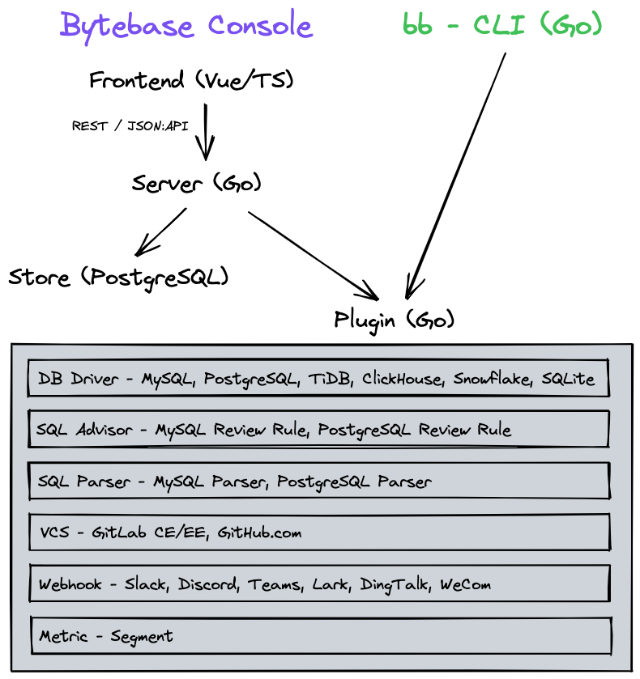

# Source Code Tour

This is [best viewed on Sourcegraph](https://sourcegraph.com/github.com/bytebase/bytebase/-/blob/docs/design/source-code-tour.snb.md).

The code snippets in this file correspond to search queries and can be displayed by clicking the button to the right of each query. For example, here is a snippet that shows off the database driver interface.

https://sourcegraph.com/github.com/bytebase/bytebase@d55481/-/blob/plugin/db/driver.go?L382-422

## Introduction

Bytebase is a database change and version control tool. It helps DevOps team to handle database CI/CD for DDL (aka schema migration) and DML. A typical application consists of the code/stateless and data/stateful part, GitLab/GitHub deals with the code change and deployment (the stateless part), while Bytebase deals with the database change and deployment (the stateful part).


## Architecture Overview



Bytebase codebase is a monorepo and builds a single binary bundling frontend (Vue), backend (Golang) and database (PostgreSQL) together. Starting the Bytebase application is simple:

```bash
$ ./bytebase
```

Bytebase also has a CLI `bb` in the same repo.

### Bundling frontend

### Bundling PostgreSQL

## Modular Design

### Plugins

### Namespacing

To keep a modular design, the codebase uses [reverse domain name notation](https://en.wikipedia.org/wiki/Reverse_domain_name_notation) extensively.

## Life of a Schema Migration Change

